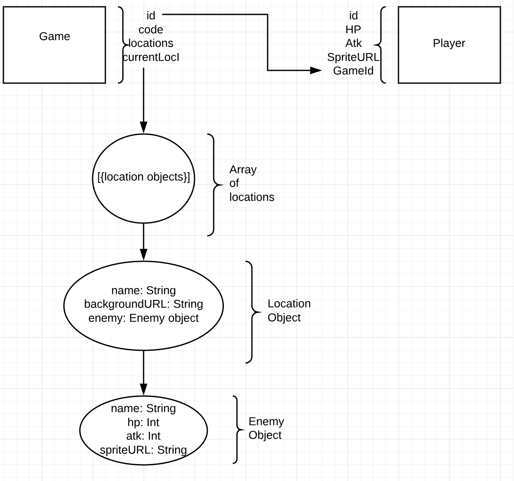

# Database Model

Our game will use four tables: Games, Player, Location, and Enemies.

- Games Table:
    - id (INT, AUTO_INCREMENT, NOT NULL)
    - playerID (INT, NOT NULL, foreign key to player table)
    - locations (JSON, NOT NULL)

- Player Table:
    - id (INT, AUTO_INCREMENT, NOT NULL)
    - gameID (INT, NOT NULL, foreign key to game table)
    - HP (INT)
    - Atk (INT)
    - SpriteURL (VARCHAR)
